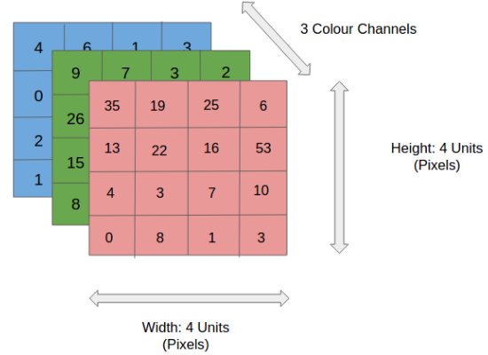

# OpenCV Tutorial
This is the code for the OpenCV Tutorial that was run internally for the Queen's AutoDrive Team

## What is OpenCV?
OpenCV is an open source library for functions aimed at classical computer vision. Most real time computer vision processing that uses classical techniques will revolve around OpenCV functions, so it's important to be comfortable with it for our purposes. 

Classical Computer vision techniques rely on the intensity of pixels in the image, and use a number of predefined algorithms to extract information from images. 

## Installation and Downloading OpenCV
From the bash terminal you can easily download OpenCV with pip using the command:

`python -m pip opencv-python `

**Note**: If pip isn't working for you - try these videos to fix it:

- <a href='https://www.youtube.com/watch?v=AdUZArA-kZw'>Windows Pip Tutorial</a>
- <a href='https://www.youtube.com/watch?v=E-WhAS6qzsU'>Mac Pip Tutorial</a>

Then you can run:
` python -m pip list `
to check that it was installed correctly. 

## Inputing Images and Accessing Properties 
To import OpenCV into a script, use the command: `import cv2` just like any other library. 

Like with other external libraries, to access OpenCV functions, you need to first tell the compiler that you want to enter that library of functions. To do so, use `cv2.function()`.

### imread
To get an image into your script use imread: `img = cv2.imread('filename')`. Instead of filename you can also put the path to the image, if it's in a different folder (etc `.\containing folder\'filename'`).

This function outputs an image mat, so I've named my inputed image 'img'. 

Imread has two important options, colour images and greyscale images. To specify this, add your choice as the second input of the function:
 - cv2.IMREAD_COLOUR (or hotkey -1)
 `cv2.imread('filename',-1)`
 - cv2.IMREAD_GRAYSCALE (or hotkey 0
)
`cv2.imread('filename',0)`

### imshow
`cv2.imshow('windowname',img)` - takes the window name that you want the image to open in (this does not need to be defined beforehand, it will create a new window if one with that name does not exist), and the image and will display the image in a seperate window. 

imshow will only display an image for as long as the compiler takes to run the line so we need:

### waitKey
`cv2.waitKey(0)` - the waitKey function pauses the compiler for as long as you specify (0 means an infinite amount of time, until a key is pressed on the keyboard). For example, `cv2.waitKey(5)` will wait on that line for 5 milliseconds before continuing to the rest of the code.

### destroyAllWindows
`cv2.destroyAllWindows()` will destory all the pop up windows from the code. This is useful to have at the end of your code, so that all windows are properly closed at the end of the script.

## Basic cv2 Image Functions

### resize
`cv2.resize(img,(height,width))` - the resize function takes in the image, and your desired number of pixels for height and width and resizes the image to those dimensions. 

Alternatively, using `cv2.resize(img,(0,0),fx=0.5,fy=0.5)` you can scale the image from it's original dimensions. This line is scaling the image by half. 

### rotate
`cv2.rotate(img,cv2.ROTATE_90_COUNTERCLOCKWISE)` - rotate will rotate your image based on your second input. Other options for rotation transforms can be shown in the documention for cv2.rotate.

### imwrite
`cv2.imwrite('new_filename.jpg',img)` - imwrite will write your image save transforms etc, to the local folder, with the new filename specified as the first input. 

## Numpy
Images are stored in numpy arrays. Numpy is an array library in python - there are many numpy functions that manipulate arrays and will therefore help us manipulate images.

**Remember** that for all operations, rows are accessed first and then columns (y and THEN x).

## Image Storage
Each pixel intensity is stored in a single numpy array cell, and has an intensity value of 0-255. Intensity values must be integers and cannot be negative. 0 is always black, or 'off', and 255 is always 'on'.

Pixels are stored like this:

`[  [ [0, 0, 0], [255, 255, 255] ],

[ [255, 255, 255], [0, 0, 0] ]  ]`

The above would represent a tiny checkerboard, with white pixels being [0,1] and [1,0] and black pixels being [0,0] and [1,1]. 

Each pixel has three values for the three channel mats, blue, green and red (this is opposite from channel forms you may have heard - like RGB). The three mats are layered on top of eachother specifying different intensity values to create the coloured images you see on screen. 

**Note**: Black and white images are made up of greyscale pixels ranging from white (value 255) to black (value 0).

Below is a visualization of a colour image's pixels:

### Some Useful Numpy Functions:
### shape
`img.shape` - which outputs a tuple (python list - object with multiple values), the rows, columns and channels (height, width, depth of the matrix) of the image. When the image is greyscale there is only one channel, so the image shape will only contain two values. 
### size
`img.size` - outputs the total number of pixels in the image (rows*columns)
### dtype
`img.dtype` - the dtype property is the image’s data type. It's often important to know this property, as a large 
number of errors in OpenCV can result from incorrect use of the data types. 

### copy
`img.copy()` - to copy an image, simply put copy() after it, and it will produce a copy of the array. The output of this function is another image, so you can set another variable name for this image copy. 

## Image Manipulation
All image manipulation is simply just matrix manipulation that we can see in a visual form. 

### Pixel Access
Just like accessing a numpy array, image pixel access looks like `img[pixel_row][pixel_column]`, which would access the intensity values for the pixel at row,column. 

## Code Examples
Code Example #1:  <a href='https://github.com/queens-autodrive/opencv-tutorial/blob/main/2.%20make_picture_border.py'>Making a Picture Border</a>

Code Example #2:  <a href='https://github.com/queens-autodrive/opencv-tutorial/blob/main/3.%20copy_paste_im.py'>Copy Region of Interest and Paste on Image</a>

Code Example #3: <a href='https://github.com/queens-autodrive/opencv-tutorial/blob/main/4.%20webcam_open.py'>Open Your Webcam</a>
    (Example: <a href='https://github.com/queens-autodrive/opencv-tutorial/raw/main/webcam_open%20demo.MOV'>Open Your Webcam Ex.</a>)

## Other Useful Tutorials:
- Tech with Tim:  <a href='https://www.youtube.com/watch?v=qCR2Weh64h4&list=PLzMcBGfZo4-lUA8uGjeXhBUUzPYc6vZRn'>OpenCV Python Tutorials Playlist</a>

- OpenCV Documentation: <a href='https://docs.opencv.org/4.x/d9/df8/tutorial_root.html'>Official OpenCV Tutorials</a>
